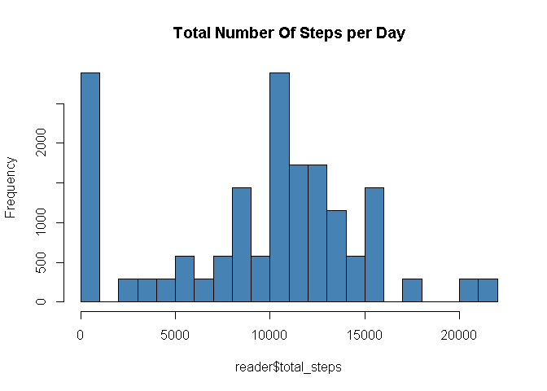
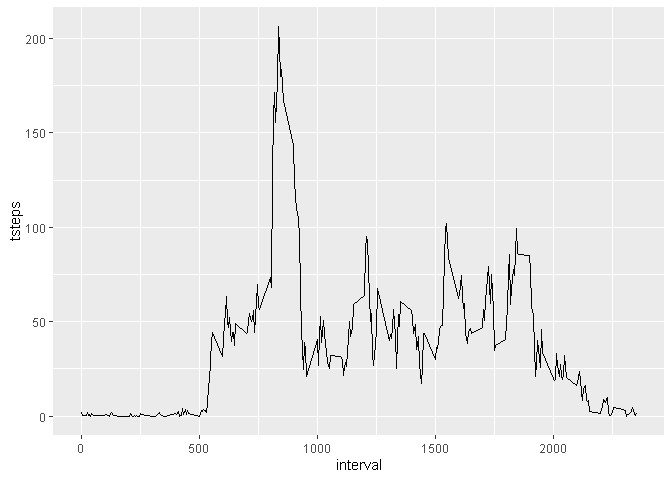
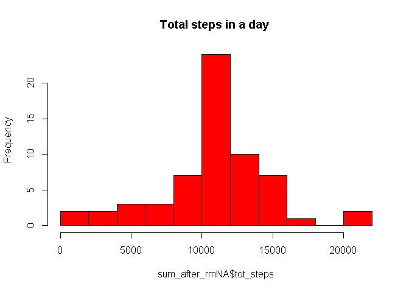
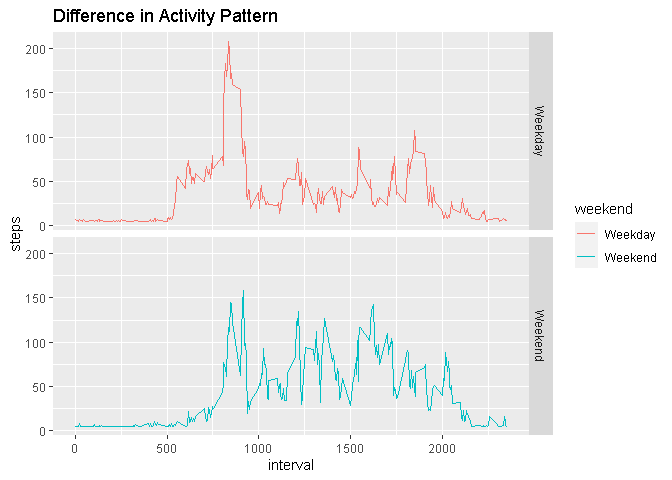

```r
library(knitr)
opts_chunk$set(echo=TRUE)
```

## Loading and preprocessing the data

```r
reader<-read.csv("activity.csv")
date=as.Date(reader$date,format = "%Y-%m-%d")
```


## What is mean total number of steps taken per day?

```r
steps_per_day<-aggregate(reader['steps'],by=reader["date"],sum,na.rm=T)
reader["total_steps"]<-steps_per_day$steps
hist(reader$total_steps,col="steelblue",main="Total Number Of Steps per Day")
```

<!-- -->

```r
mean(reader$total_steps,na.rm=TRUE)
```

```
## [1] 9354.23
```

```r
median(reader$total_steps,na.rm=TRUE)
```

```
## [1] 10395
```


## What is the average daily activity pattern?


```r
library(ggplot2)
library(dplyr)
```

```
## 
## Attaching package: 'dplyr'
```

```
## The following objects are masked from 'package:stats':
## 
##     filter, lag
```

```
## The following objects are masked from 'package:base':
## 
##     intersect, setdiff, setequal, union
```

```r
average<-reader%>%
  select(interval,steps)%>%
  group_by(interval)%>%
  summarise(tsteps=mean(steps,na.rm=T))
g<-ggplot(average,aes(x=interval,y=tsteps))+geom_line()
g
```

<!-- -->


## Imputing missing values

```r
list_na <- colnames(reader)[ apply(reader, 2, anyNA) ]
list_na
```

```
## [1] "steps"
```

```r
reader[is.na(reader)]=mean(reader$steps,na.rm=T)
# Replace NA values with Mean of Steps
head(reader)
```

```
##     steps       date interval total_steps
## 1 37.3826 2012-10-01        0           0
## 2 37.3826 2012-10-01        5         126
## 3 37.3826 2012-10-01       10       11352
## 4 37.3826 2012-10-01       15       12116
## 5 37.3826 2012-10-01       20       13294
## 6 37.3826 2012-10-01       25       15420
```

```r
summary(reader)
```

```
##      steps            date              interval       total_steps   
##  Min.   :  0.00   Length:17568       Min.   :   0.0   Min.   :    0  
##  1st Qu.:  0.00   Class :character   1st Qu.: 588.8   1st Qu.: 6778  
##  Median :  0.00   Mode  :character   Median :1177.5   Median :10395  
##  Mean   : 37.38                      Mean   :1177.5   Mean   : 9354  
##  3rd Qu.: 37.38                      3rd Qu.:1766.2   3rd Qu.:12811  
##  Max.   :806.00                      Max.   :2355.0   Max.   :21194
```

```r
#Comparision of total steps with and without NA values
library(dplyr)
filled.reader<-reader
sum_after_rmNA<-reader%>%
  
  group_by(date)%>%
  summarise(tot_steps=sum(steps))
hist(sum_after_rmNA$tot_steps,col="red",main="Total steps in a day ",breaks = 10)
```

<!-- -->

```r
mean(sum_after_rmNA$tot_steps)
```

```
## [1] 10766.19
```

```r
median(sum_after_rmNA$tot_steps)
```

```
## [1] 10766.19
```


## Are there differences in activity patterns between weekdays and weekends?

```r
filled.reader$date<-as.Date(filled.reader$date)
filled.reader$weekday<-weekdays(filled.reader$date)
filled.reader$weekend<-ifelse(filled.reader$weekday=="Saturday"|filled.reader$weekday=="Sunday","Weekend","Weekday")
head(filled.reader)
```

```
##     steps       date interval total_steps weekday weekend
## 1 37.3826 2012-10-01        0           0  Monday Weekday
## 2 37.3826 2012-10-01        5         126  Monday Weekday
## 3 37.3826 2012-10-01       10       11352  Monday Weekday
## 4 37.3826 2012-10-01       15       12116  Monday Weekday
## 5 37.3826 2012-10-01       20       13294  Monday Weekday
## 6 37.3826 2012-10-01       25       15420  Monday Weekday
```


```r
library(ggplot2)
meansteps_weekday_end<-aggregate(filled.reader$steps,by=list(filled.reader$weekend,filled.reader$interval),na.omit(mean))
names(meansteps_weekday_end)<-c("weekend","interval","steps")
g<-ggplot(meansteps_weekday_end,aes(x=interval,y=steps,color=weekend))+geom_line()+facet_grid(weekend~.)+labs(title="Difference in Activity Pattern")
g
```

<!-- -->


